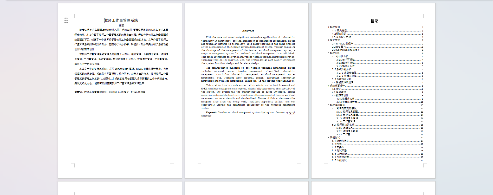
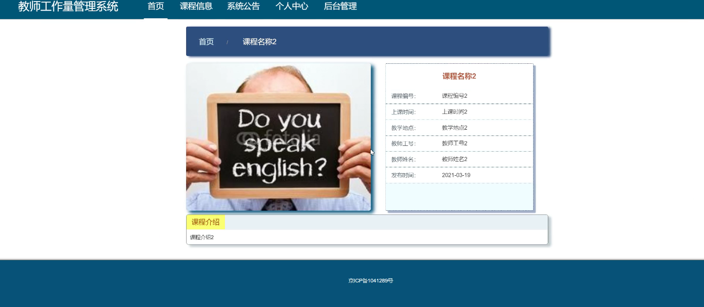
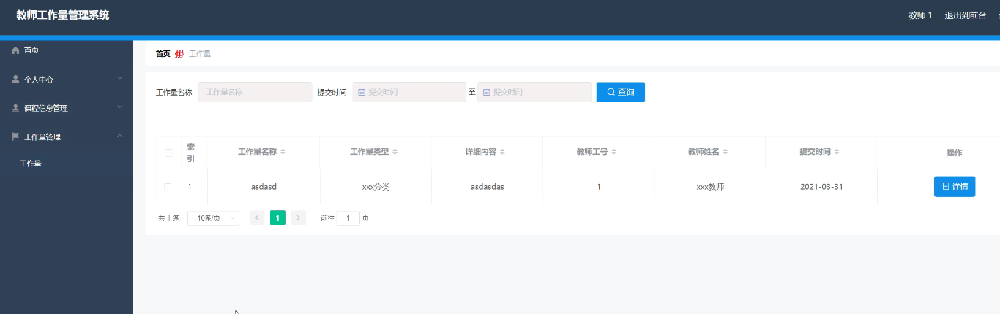

基于Springboot的教师工作量管理系统（程序+论文）
=
### 完整代码获取地址：从戎源码网 ([https://armycodes.com/](https://armycodes.com/))
### 作者微信：19941326836  QQ：952045282 
### 承接计算机毕业设计、Java毕业设计、Python毕业设计、深度学习、机器学习
### 选题+开题报告+任务书+程序定制+安装调试+论文+答辩ppt 一条龙服务
### 所有选题地址https://github.com/nature924/allProject

一、项目介绍
---
系统包含两种角色：用户、管理员，系统分为前台和后台两大模块，主要功能如下：

### 【用户功能】

### 管理员模块的实现

- 教师信息管理  
  系统管理员可以管理教师信息，包括对教师信息的修改、删除以及查询操作。

- 分类信息管理  
  系统管理员可以对分类信息进行添加、修改、删除以及查询操作。

- 课程信息管理  
  系统管理员可以对课程信息进行添加、修改、删除以及查询操作。

- 工作量管理  
  系统管理员可以对教师的工作量进行添加、修改、删除操作。

### 教师模块的实现

- 课程信息  
  教师可以查看前台展示的课程信息。

- 课程信息管理  
  教师可以查看并管理自己的课程信息。

- 工作量  
  教师可以查看自己的工作量信息。

二、项目技术
---
- 编程语言：Java
- 数据库：MySQL
- 项目管理工具：Maven
- 前端技术：VUE、HTML、Jquery、Bootstrap
- 后端技术：Spring、SpringMVC、MyBatis

三、运行环境
---
- 操作系统：Windows、macOS都可以
- JDK版本：JDK1.8以上都可以
- 开发工具：IDEA、Ecplise、Myecplise都可以
- 数据库: MySQL5.7以上都可以
- Tomcat：任意版本都可以
- Maven：任意版本都可以

四、运行截图
---
### 论文截图：

### 程序截图：

